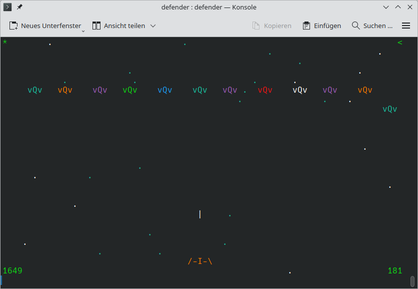
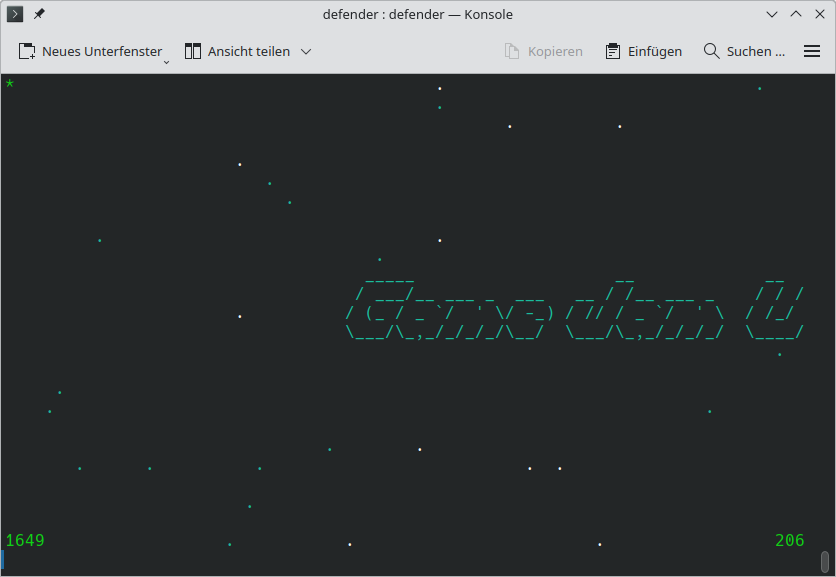

# Defender
Space Invaders like game for the linux terminal.

The player controls a spaceship and must defend as many space sectors as possible against attacking aliens.

# Why?
This project was my contribution to the winter term 2020/21 Game Jam at the University of Göttingen.
The task was to write a linux terminal game in C. Using external libraries (e.g. ncurses) was not allowed.

# Build
Run `make` from the project root directory.

# Keys
- Title screen
    - q: quit
    - space: start new game
- In game
    - q: quit to title screen
    - a: move left
    - d: move right
    - space: shoot / start next sector
- Used for development but not deactivated
    - w: move up
    - s: move down
    - o: animated background on/off

# Displayed game information
- top left: cleared sectors count
- top right: number of lifes
- bottom left: hiscore
- bottom right: score

# Known issues
On some systems heavy screen flickering occurs, rendering the game unplayable.
